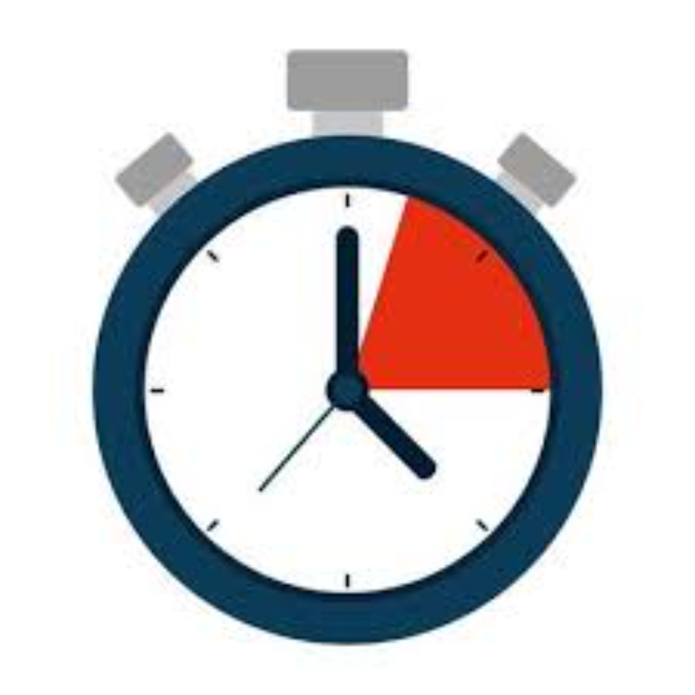
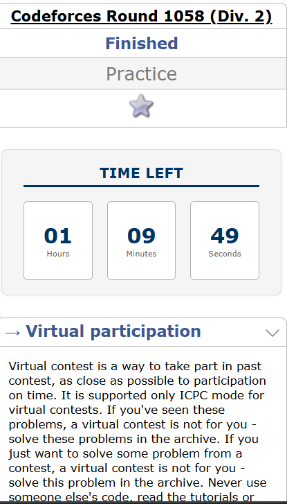
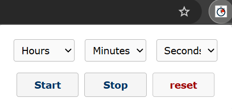

# Cp-Clock
A Google Chrome Extension for users for speed solving and time management in Codeforces.
<h1 align="center">Codeforces Timer</h1>

  

## 🖼️ Preview

  

 

  

## 🚀 Usage

The **Cp Clock** Chrome Extension is designed for competitive programmers who want to manage their time while solving problems on [Codeforces](https://codeforces.com).

### ⏱️ Features:
- Countdown timer visible on every Codeforces problem page.
- Set custom hours, minutes, and seconds.
- Start, stop, or reset the timer anytime.
- Timer remains persistent across tab reloads using Chrome's local storage.

### 🧭 How to Use:

1. **Install the Extension**  
   - Download repo as **.zip**
   - Open Google Chrome -> Settings -> Extensions -> On Developer Mode -> Load Unpacked Extensions -> Point to the extracted folder.
   - Pin the Extension to set timer

2. **Set Your Time**
   - Click the extension icon in the Chrome toolbar.
   - Enter the desired time (hours, minutes, seconds).

3. **Start the Timer**
   - Hit the **Start** button to begin countdown.
   - Timer will appear on the **right sidebar** of any Codeforces problem page.

4. **Reset / Stop**
   - Use the popup controls to reset or stop the timer.
   - Timer automatically stops and alerts when time runs out.

### 📌 Use Case:
This extension is perfect for:
- Practicing virtual contests.
- Speed-solving individual problems with a time limit.
- Managing time like in real contests without external tools.

